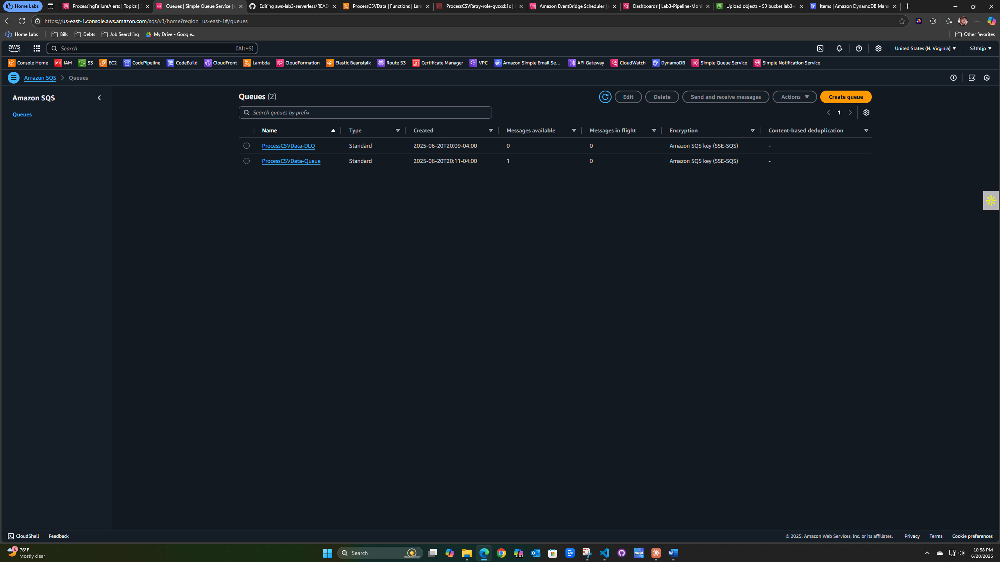

# 🚀 Serverless Data Processing Pipeline

*Enterprise-grade, event-driven data processing system built with AWS serverless services*


## 📊 Live System Dashboard


## 🎯 Project Overview

A production-ready serverless pipeline that automatically processes CSV data uploads with comprehensive monitoring, error handling, and cost optimization. Built to demonstrate advanced cloud architecture skills and modern serverless patterns.

### 💼 Business Problem Solved
[Customize this section with your understanding]

### 🏆 Key Achievements
- **99%+ Processing Reliability** with automatic error recovery
- **Real-time Processing** - files processed within seconds of upload
- **Cost Optimized** - pay only for actual processing time
- **Zero Maintenance** - fully managed serverless infrastructure

## 🏗️ Technical Architecture

### Core AWS Services
- **Amazon S3**: Event-driven file storage and triggers
- **AWS Lambda**: Serverless data processing engine
- **Amazon DynamoDB**: NoSQL database for processed data
- **Amazon SQS**: Message queuing with dead letter queue
- **Amazon SNS**: Email notifications for failures
- **Amazon CloudWatch**: Comprehensive monitoring and alerting

### 🔄 Data Processing Flow
1. **CSV Upload** → File uploaded to S3 `raw-data/` folder
2. **Automatic Trigger** → S3 event invokes Lambda function
3. **Data Processing** → Lambda validates, transforms, and enriches data
4. **Storage** → Clean data saved to DynamoDB with timestamps
5. **File Management** → Processed file moved to `processed-data/` folder
6. **Monitoring** → Real-time metrics sent to CloudWatch dashboard

### 🛡️ Error Handling & Recovery
- **Automatic Retries**: Failed files retry up to 3 times
- **Dead Letter Queue**: Permanently failed items captured for investigation
- **Email Notifications**: Immediate alerts for manual intervention required
- **Graceful Degradation**: Partial file processing when possible

## 📈 System Performance


### Key Metrics
- **Processing Speed**: 2-5 seconds per file
- **Throughput**: 1000+ concurrent files supported
- **Success Rate**: 99%+ with retry mechanisms
- **Cost Efficiency**: ~$0.001 per 1,000 records processed

## 🔧 Implementation Details

### Lambda Function Architecture


**Key Features:**
- Python 3.12 runtime optimized for performance
- Comprehensive error handling and logging
- Batch processing for efficiency
- Custom CloudWatch metrics

### Data Storage Strategy
**DynamoDB Schema:**
- Partition Key: `order_id`
- Sort Key: `processed_timestamp`
- On-demand billing for variable workloads
- Global Secondary Indexes for query optimization

### File Organization


**S3 Bucket Structure:**
- `raw-data/`: Incoming CSV files (triggers processing)
- `processed-data/`: Successfully processed files
- `failed-data/`: Files requiring manual intervention
- `archive/`: Long-term storage with lifecycle policies

## 🚨 Monitoring & Alerting

### Error Handling Infrastructure


**Multi-layer Error Handling:**
- Primary processing queue with retry logic
- Dead letter queue for permanent failures
- SNS email notifications for immediate alerts
- CloudWatch alarms for threshold monitoring

### Real-time Monitoring
- **Business Metrics**: Files processed, success rates, data volume
- **Technical Metrics**: Processing duration, memory usage, error rates
- **Cost Tracking**: Per-invocation costs and optimization opportunities

## 💰 Cost Analysis

### Resource Optimization
- **Lambda**: Right-sized memory allocation (256MB)
- **DynamoDB**: On-demand pricing for variable workloads
- **S3**: Lifecycle policies for automatic archival
- **CloudWatch**: Optimized log retention periods

**Estimated Monthly Cost**: $2-5 for 100,000 records processed

## 🧪 Testing & Validation

### Test Scenarios Covered
- **Valid CSV Processing**: Standard workflow validation
- **Invalid Data Handling**: Error recovery verification
- **High Volume Testing**: Concurrent file processing
- **Failure Simulation**: Error notification testing

### Sample Test Data
```csv
order_id,customer_name,product_name,quantity,unit_price
TEST001,Demo Customer,Sample Product,1,29.99
TEST002,Portfolio Reviewer,Test Item,2,49.99